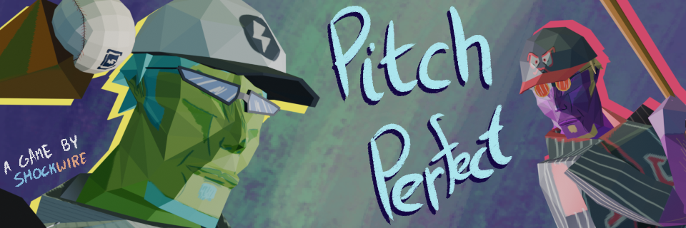

Pitch Perfect
=

**[Play now on itch.io](https://shockwire.itch.io/pitch-perfect)**

Can you throw a perfect game? No walks, no hits! Just strike out 9 batters in a row, and you win!

Created in under 168 hours for Brackeys Game Jam 2025.1.
Developed in Godot 4.3. Should support all platforsm Godot does, although it has only been tested on WASM and Windows.

Controls:
===
Your goal is to strike-out 9 batters in a row, without allowing a single hit or run. This means you need 3 strikes per batter.
Use mouse to aim. Left-click on mouse (or press Spacebar) to begin throwing a pitch.
Try to match your power level with the sweet-spot given to you. Also make sure to aim in the box

Tools used:
===
- Godot 4.3
- Blender 4.3.2
- Krita 4.4.2
- Reaper v7.33
